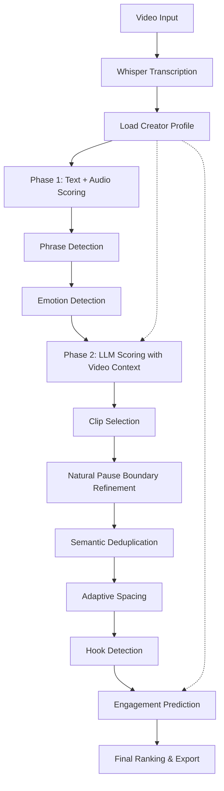

# Design Document: Clip Selection Improvements

## Overview

The Clip Selection Improvements feature enhances the video highlight generator's intelligence and context-awareness through nine major subsystems. The design integrates seamlessly with the existing multi-phase scoring pipeline (text → audio → LLM) while adding creator-specific calibration, semantic understanding, and engagement prediction capabilities.

**Core Philosophy**: All improvements work with data available at generation time (transcript, audio, video, LLM analysis) — no external APIs or post-publication metrics required.

**Integration Strategy**: Extend existing modules (`scorer.py`, `clip_selector.py`, `config.py`) and add new focused modules for specialized functionality.

## Architecture

### High-Level Pipeline Flow



### Module Responsibilities

| Module | Responsibility | Integration Point |
|--------|---------------|-------------------|
| `creator_profile.py` | Load/save creator metadata, calibrate scoring | `main.py` startup, `scorer.py` LLM prompts |
| `phrase_detector.py` | Multi-word keyword matching | `scorer.py::compute_text_score()` |
| `emotion_detector.py` | Audio emotion classification (librosa) | `scorer.py::compute_audio_features()` |
| `pause_detector.py` | Natural pause identification | `clip_selector.py::refine_clip_boundaries_with_llm()` |
| `semantic_dedup.py` | Embedding-based similarity | `clip_selector.py::select_clips()` |
| `adaptive_spacing.py` | Dynamic spacing constraints | `clip_selector.py::_apply_spacing()` |
| `hook_detector.py` | Viral hook classification | `scorer.py::score_segments()` (already exists) |
| `engagement_predictor.py` | Retention estimation | `clip_selector.py::select_clips()` |
| `config.py` | Extended configuration schema | All modules |

## Components and Interfaces

### 1. Creator Profile System

**Purpose**: Persist creator-specific metadata to calibrate scoring across videos.

#### Data Model

```python
@dataclass
class CreatorProfile:
    """Persistent creator metadata for scoring calibration."""
    creator_id: str                    # Unique identifier (channel name or hash)
    content_type: str                  # "gaming" | "podcast" | "comedy" | "vlog" | "educational"
    energy_level: str                  # "high" | "moderate" | "calm"
    typical_clip_duration: float       # Average preferred clip length (seconds)
    keyword_overrides: list[str]       # Creator-specific keywords to add
    created_at: str                    # ISO 8601 timestamp
    updated_at: str                    # ISO 8601 timestamp
    video_count: int                   # Number of videos processed with this profile
    
    def to_dict(self) -> dict:
        """Serialize to JSON-compatible dict."""
        ...
    
    @classmethod
    def from_dict(cls, data: dict) -> CreatorProfile:
        """Deserialize from JSON dict."""
        ...
```

#### File Format

**Location**: `~/.cache/local-clipper/profiles/{creator_id}.json`

```json
{
  "creator_id": "gaming_streamer_123",
  "content_type": "gaming",
  "energy_level": "high",
  "typical_clip_duration": 35.0,
  "keyword_overrides": ["clutch", "gg", "let's go"],
  "created_at": "2024-01-15T10:30:00Z",
  "updated_at": "2024-01-20T14:45:00Z",
  "video_count": 12
}
```

#### API

```python
def load_creator_profile(creator_id: str) -> CreatorProfile | None:
    """Load profile from disk, return None if not found."""
    ...

def save_creator_profile(profile: CreatorProfile) -> None:
    """Save profile to disk, create directory if needed."""
    ...

def create_default_profile(creator_id: str, content_type: str = "auto") -> CreatorProfile:
    """Create a new profile with sensible defaults."""
    ...
```

#### Integration

- **Initialization**: `main.py` loads profile at startup via `--creator-id` flag
- **LLM Calibration**: `scorer.py::_score_window_with_llm()` prepends profile context to prompts
- **Weight Adjustment**: `config.py` adjusts `text_weight`/`audio_weight` based on `energy_level`

### 2. Video Context LLM Scoring

**Purpose**: Generate a video-level summary to provide context for all LLM scoring calls.

#### Algorithm

```python
def generate_video_summary(config: Config, transcript: Transcript) -> str:
    """Generate a 2-3 sentence video summary for LLM context.
    
    Strategy:
    1. Sample transcript: take every Nth segment (N = len(segments) // 20)
    2. Build condensed transcript (max 500 words)
    3. Send to LLM with summary prompt
    4. Cache result in memory for reuse
    
    Returns:
        Summary string (e.g., "This is a Minecraft survival stream where the 
        creator builds a base while fighting mobs. High energy with frequent 
        reactions to unexpected events.")
    """
    ...
```

#### Prompt Template

```
You are analyzing a video transcript to provide context for clip selection.

Below is a condensed transcript (sampled segments from a {duration}-minute video):

{condensed_transcript}

Provide a 2-3 sentence summary covering:
1. Content type (gaming, podcast, comedy, etc.)
2. Main topics or activities
3. Overall energy level (high-energy, calm, moderate)
4. Key recurring themes or patterns

Summary:
```

#### Integration

- **Caching**: Store summary in `scorer.py` module-level variable, keyed by video path
- **Prepending**: All `_score_window_with_llm()` calls prepend summary to window prompts
- **Format**: `"VIDEO CONTEXT: {summary}\n\nWINDOW TRANSCRIPT:\n{window}"`

### 3. Phrase Detection

**Purpose**: Match multi-word keyword phrases (e.g., "oh my god") as atomic units.

#### Algorithm

```python
def detect_phrases(text: str, phrases: list[str]) -> list[tuple[str, int, int]]:
    """Find all phrase matches in text with positions.
    
    Args:
        text: Input text (segment.text)
        phrases: List of multi-word phrases (e.g., ["oh my god", "no way"])
    
    Returns:
        List of (phrase, start_pos, end_pos) tuples
    
    Algorithm:
    1. Normalize text: lowercase, preserve word boundaries
    2. For each phrase:
       a. Build regex: r'\b' + re.escape(phrase) + r'\b'
       b. Find all matches with positions
    3. Return sorted by start_pos
    """
    ...
```

#### Scoring Integration

```python
# In compute_text_score():
phrase_matches = detect_phrases(text, config.phrase_keywords)
for phrase, start, end in phrase_matches:
    raw_score += config.phrase_weight  # Default: 4.0 (higher than single keyword)
```

#### Configuration

```python
# In Config class:
phrase_keywords: list[str] = field(default_factory=lambda: [
    "oh my god", "no way", "watch this", "look at this",
    "are you kidding", "i can't believe", "what the hell"
])
phrase_weight: float = 4.0  # vs 2.0 for single keywords
```

### 4. Natural Pause Detection

**Purpose**: Identify sentence boundaries and silence gaps for natural clip endings.

#### Data Model

```python
@dataclass
class NaturalPause:
    """Represents a natural pause point in the transcript."""
    time: float                # Timestamp (seconds)
    type: str                  # "punctuation" | "silence" | "breath"
    confidence: float          # 0.0-1.0 (higher = stronger pause signal)
    context: str               # Surrounding text for debugging
```

#### Algorithm

```python
def detect_natural_pauses(
    transcript: Transcript,
    wav_path: str,
    silence_threshold: float = 0.5,  # seconds
) -> list[NaturalPause]:
    """Detect natural pause points from transcript and audio.
    
    Strategy:
    1. Punctuation pauses: Find '.', '!', '?' in transcript
    2. Silence pauses: Detect gaps > silence_threshold between segments
    3. Breath pauses: Detect short silence within segments (RMS < 10% of mean)
    4. Assign confidence: punctuation=0.9, silence=0.8, breath=0.6
    
    Returns:
        Sorted list of NaturalPause objects
    """
    ...

def snap_to_nearest_pause(
    time: float,
    pauses: list[NaturalPause],
    max_distance: float = 3.0,
) -> float:
    """Snap a timestamp to the nearest natural pause within max_distance.
    
    Returns:
        Adjusted timestamp, or original if no pause found
    """
    ...
```

#### Integration

```python
# In clip_selector.py::refine_clip_boundaries_with_llm():
pauses = detect_natural_pauses(transcript, wav_path)

# After LLM suggests boundaries:
new_end = snap_to_nearest_pause(llm_suggested_end, pauses, max_distance=3.0)
```

### 5. Emotion Detection

**Purpose**: Classify audio segments by emotional content (laughter, screaming, excitement).

#### Data Model

```python
@dataclass
class EmotionFeatures:
    """Audio features for emotion classification."""
    time: float                # Timestamp (seconds)
    pitch_mean: float          # Hz (fundamental frequency)
    pitch_std: float           # Hz (pitch variation)
    volume_rms: float          # 0.0-1.0 (normalized)
    spectral_centroid: float   # Hz (brightness)
    zero_crossing_rate: float  # Crossings per sample
    emotion: str               # "laughter" | "scream" | "excitement" | "calm" | "neutral"
    confidence: float          # 0.0-1.0
```

#### Algorithm

```python
def extract_emotion_features(wav_path: str, window_size: float = 0.5) -> list[EmotionFeatures]:
    """Extract emotion features using librosa.
    
    Strategy:
    1. Load audio with librosa
    2. Extract features per window:
       - Pitch: librosa.pyin() for F0 tracking
       - Volume: librosa.feature.rms()
       - Spectral centroid: librosa.feature.spectral_centroid()
       - ZCR: librosa.feature.zero_crossing_rate()
    3. Classify emotion using heuristic rules:
       - Laughter: high ZCR + pitch variation + moderate volume
       - Scream: high pitch + high volume + high spectral centroid
       - Excitement: high volume + high pitch + low ZCR
       - Calm: low volume + low pitch variation
       - Neutral: default
    4. Assign confidence based on feature strength
    
    Returns:
        List of EmotionFeatures objects
    """
    ...
```

#### Classification Rules

| Emotion | Pitch | Volume | ZCR | Spectral Centroid |
|---------|-------|--------|-----|-------------------|
| Laughter | Moderate (150-300 Hz) | Moderate (0.3-0.7) | High (>0.15) | Moderate |
| Scream | High (>400 Hz) | High (>0.7) | Moderate | High (>3000 Hz) |
| Excitement | High (>300 Hz) | High (>0.6) | Low (<0.1) | High |
| Calm | Low (<200 Hz) | Low (<0.3) | Low | Low (<2000 Hz) |
| Neutral | Any | Any | Any | Any |

#### Integration

```python
# In scorer.py::score_segments():
emotion_features = extract_emotion_features(wav_path)

# Map segments to emotion scores:
for seg in segments:
    emotion = get_emotion_for_segment(seg, emotion_features)
    if emotion.emotion in ["laughter", "scream", "excitement"]:
        audio_score *= (1.0 + 0.3 * emotion.confidence)  # 30% boost
```

### 6. Semantic Deduplication

**Purpose**: Detect semantically similar clips beyond simple word overlap.

#### Algorithm

```python
def compute_semantic_similarity(
    clip_a: Clip,
    clip_b: Clip,
    transcript: Transcript,
    model: SentenceTransformer,
) -> float:
    """Compute cosine similarity between clip embeddings.
    
    Strategy:
    1. Extract transcript text for each clip
    2. Encode with sentence-transformers (all-MiniLM-L6-v2)
    3. Compute cosine similarity
    
    Returns:
        Similarity score 0.0-1.0
    """
    ...

def deduplicate_semantic(
    clips: list[Clip],
    transcript: Transcript,
    threshold: float = 0.8,
) -> list[Clip]:
    """Remove semantically similar clips.
    
    Strategy:
    1. Load sentence-transformers model (cached)
    2. Compute pairwise similarities
    3. For each pair above threshold, discard lower-scoring clip
    4. Return deduplicated list
    
    Returns:
        Filtered clip list
    """
    ...
```

#### Model Selection

- **Model**: `sentence-transformers/all-MiniLM-L6-v2`
- **Rationale**: Fast (384-dim embeddings), good semantic understanding, runs on CPU
- **Fallback**: If model unavailable, fall back to Jaccard similarity (existing)

#### Integration

```python
# In clip_selector.py::select_clips():
# After Jaccard deduplication:
if config.semantic_dedup_enabled:
    clips = deduplicate_semantic(clips, transcript, config.semantic_dedup_threshold)
```

### 7. Adaptive Spacing

**Purpose**: Dynamically adjust spacing constraints based on video length.

#### Algorithm

```python
def compute_adaptive_spacing(
    video_duration: float,
    top_n_clips: int,
    base_spacing: float,
) -> float:
    """Compute effective spacing constraint.
    
    Strategy:
    1. Calculate required spacing: video_duration / (top_n_clips + 1)
    2. If required < base_spacing, scale down proportionally
    3. Apply minimum floor (30s) to prevent over-clustering
    
    Formula:
        effective = max(30.0, min(base_spacing, video_duration / (top_n_clips + 1)))
    
    Returns:
        Effective spacing in seconds
    """
    ...
```

#### Examples

| Video Duration | top_n_clips | base_spacing | effective_spacing |
|----------------|-------------|--------------|-------------------|
| 600s (10 min) | 6 | 300s | 85s |
| 1800s (30 min) | 6 | 300s | 257s |
| 3600s (60 min) | 6 | 300s | 300s |
| 300s (5 min) | 6 | 300s | 42s |

#### Integration

```python
# In clip_selector.py::select_clips():
effective_spacing = compute_adaptive_spacing(
    video_duration, config.top_n_clips, config.min_clip_spacing
)
clips = _apply_spacing(clips, effective_spacing, config.top_n_clips)
```

### 8. Hook Detection

**Purpose**: Identify viral hooks in the first 3 seconds of clips.

**Status**: Already partially implemented in `hook_detector.py`. Design extends existing implementation.

#### Enhanced Algorithm

```python
def classify_hook(
    config: Config,
    window_text: str,
) -> tuple[str, float]:
    """Classify hook type and quality using LLM.
    
    Prompt:
        "Classify this opening (first 3 seconds) as a hook type:
        - question: Poses a question to viewer
        - shocking: Unexpected or surprising statement
        - action: Immediate action or event
        - mystery: Creates curiosity or suspense
        - none: Generic opening, no hook
        
        Text: {window_text}
        
        Respond: TYPE: <type>, SCORE: <0.0-1.0>"
    
    Returns:
        (hook_type, hook_score)
    """
    ...
```

#### Integration

```python
# In clip_selector.py::select_clips():
for clip in clips:
    first_3s_text = get_clip_text(clip, transcript, duration=3.0)
    hook_type, hook_score = classify_hook(config, first_3s_text)
    
    if hook_score > config.hook_score_threshold:
        clip.score *= (1.0 + config.hook_boost_multiplier * hook_score)
```

### 9. Engagement Prediction

**Purpose**: Estimate viewer retention based on clip features.

#### Data Model

```python
@dataclass
class EngagementFeatures:
    """Features for engagement prediction."""
    duration: float              # Clip length (seconds)
    pacing_score: float          # Words per second (normalized)
    energy_curve: list[float]    # Audio energy over time
    hook_score: float            # Opening hook quality
    emotion_diversity: float     # Variety of emotions detected
    pause_quality: float         # Natural ending quality
```

#### Algorithm

```python
def predict_engagement(
    clip: Clip,
    transcript: Transcript,
    emotion_features: list[EmotionFeatures],
    hook_score: float,
) -> float:
    """Predict viewer retention (0.0-1.0) using heuristic model.
    
    Model:
        retention = 0.2 * duration_score +
                    0.25 * pacing_score +
                    0.2 * energy_score +
                    0.2 * hook_score +
                    0.15 * emotion_diversity
    
    Where:
        - duration_score: 1.0 at 30s, decays to 0.5 at 60s
        - pacing_score: 1.0 at 3-5 words/sec, lower outside range
        - energy_score: Mean audio energy (normalized)
        - hook_score: From hook detector
        - emotion_diversity: Unique emotions / total windows
    
    Returns:
        Retention estimate 0.0-1.0
    """
    ...
```

#### Integration

```python
# In clip_selector.py::select_clips():
for clip in clips:
    retention = predict_engagement(clip, transcript, emotion_features, hook_score)
    
    # Boost high-retention clips:
    if retention > 0.7:
        clip.score *= 1.2
    elif retention < 0.3:
        clip.score *= 0.8
```

## Data Models

### Extended Config Schema

```python
@dataclass
class Config:
    # ... existing fields ...
    
    # Creator Profile
    creator_id: str | None = None
    creator_profile_path: str = field(default_factory=lambda: 
        os.path.expanduser("~/.cache/local-clipper/profiles"))
    
    # Phrase Detection
    phrase_keywords: list[str] = field(default_factory=lambda: [
        "oh my god", "no way", "watch this", "look at this",
        "are you kidding", "i can't believe", "what the hell"
    ])
    phrase_weight: float = 4.0
    
    # Emotion Detection
    emotion_detection_enabled: bool = True
    emotion_boost_multiplier: float = 0.3
    
    # Semantic Deduplication
    semantic_dedup_enabled: bool = True
    semantic_dedup_threshold: float = 0.8
    semantic_dedup_model: str = "sentence-transformers/all-MiniLM-L6-v2"
    
    # Adaptive Spacing
    adaptive_spacing_enabled: bool = True
    adaptive_spacing_min_floor: float = 30.0
    
    # Hook Detection (extended)
    hook_boost_multiplier: float = 0.4
    hook_score_threshold: float = 0.6
    
    # Engagement Prediction
    engagement_prediction_enabled: bool = True
    engagement_high_threshold: float = 0.7
    engagement_low_threshold: float = 0.3
    engagement_high_boost: float = 1.2
    engagement_low_penalty: float = 0.8
    
    # Video Context
    video_summary_enabled: bool = True
    video_summary_sample_rate: int = 20  # Take every Nth segment
    video_summary_max_words: int = 500
```

### New Models

```python
# In pipeline/models.py:

@dataclass
class CreatorProfile:
    creator_id: str
    content_type: str
    energy_level: str
    typical_clip_duration: float
    keyword_overrides: list[str]
    created_at: str
    updated_at: str
    video_count: int

@dataclass
class NaturalPause:
    time: float
    type: str
    confidence: float
    context: str

@dataclass
class EmotionFeatures:
    time: float
    pitch_mean: float
    pitch_std: float
    volume_rms: float
    spectral_centroid: float
    zero_crossing_rate: float
    emotion: str
    confidence: float

@dataclass
class EngagementFeatures:
    duration: float
    pacing_score: float
    energy_curve: list[float]
    hook_score: float
    emotion_diversity: float
    pause_quality: float
```

## Error Handling

### Graceful Degradation Strategy

| Component | Failure Mode | Fallback Behavior |
|-----------|--------------|-------------------|
| Creator Profile | File not found | Create default profile, continue |
| Emotion Detection | librosa not installed | Skip emotion scoring, log warning |
| Semantic Dedup | Model download fails | Fall back to Jaccard similarity |
| LLM Video Summary | LLM unavailable | Skip summary, use generic prompts |
| Hook Detection | LLM timeout | Assign hook_score=0.0, continue |
| Engagement Prediction | Feature extraction fails | Assign retention=0.5 (neutral) |

### Error Logging

```python
# Consistent error format:
logger.warning(
    "[%s] %s failed: %s. Falling back to %s.",
    component_name, operation, error, fallback_strategy
)
```

## Correctness Properties

*A property is a characteristic or behavior that should hold true across all valid executions of a system—essentially, a formal statement about what the system should do. Properties serve as the bridge between human-readable specifications and machine-verifiable correctness guarantees.*

### Property Reflection

After analyzing all acceptance criteria, the following properties were identified as testable via property-based testing. Redundant properties have been consolidated:

**Consolidated Properties**:
- Properties 1.2 and 1.3 (content type and energy level storage) are combined into Property 1 (profile field persistence)
- Properties 15.1, 15.2, 15.4, 15.5 are all subsumed by Property 2 (round-trip serialization)
- Properties 4.1 and 4.2 (phrase detection) are combined into Property 3 (phrase matching)
- Properties 5.3 and 5.4 (punctuation and silence pauses) are combined into Property 5 (pause detection)
- Properties 6.2 and 6.3 (emotion classification and scoring) are combined into Property 6 (emotion classification)
- Properties 7.1 and 7.2 (similarity computation and threshold) are combined into Property 7 (semantic similarity)
- Properties 16.3 and 16.4 (weight sum and duration ordering) are combined into Property 11 (config validation)

### Property 1: Profile Field Persistence

*For any* valid CreatorProfile object with any content_type, energy_level, and other fields, storing those fields and retrieving them should preserve all values exactly.

**Validates: Requirements 1.2, 1.3, 1.4**

### Property 2: Creator Profile Round-Trip Serialization

*For any* valid CreatorProfile object, serializing to JSON then deserializing back to an object should produce an equivalent CreatorProfile with all fields preserved.

**Validates: Requirements 15.6**

### Property 3: Phrase Detection with Word Boundaries

*For any* text containing a multi-word phrase from the phrase list, the phrase detector should find it regardless of case, but should NOT match if word boundaries are violated (e.g., "oh my god" should match "Oh My God!" but not "ohmygod").

**Validates: Requirements 4.1, 4.2, 4.4**

### Property 4: Phrase Weight Superiority

*For any* text containing a phrase match, the computed text score should be higher than the same text with only individual word matches (phrase_weight > keyword_weight).

**Validates: Requirements 4.3**

### Property 5: Natural Pause Detection

*For any* transcript with punctuation marks (., !, ?) or silence gaps (>0.5s), the pause detector should identify pauses at those locations with appropriate confidence scores.

**Validates: Requirements 5.1, 5.3, 5.4**

### Property 6: Pause Boundary Snapping

*For any* timestamp and list of natural pauses, snapping to the nearest pause within max_distance should return a pause time within that distance, or the original time if no pause exists nearby.

**Validates: Requirements 5.2**

### Property 7: Emotion Classification Bounds

*For any* audio segment, the emotion detector should assign an emotion category (laughter, scream, excitement, calm, neutral) and a confidence score in the range [0.0, 1.0].

**Validates: Requirements 6.2, 6.3**

### Property 8: Semantic Similarity Symmetry and Bounds

*For any* two clip transcripts A and B, the semantic similarity should be symmetric (sim(A,B) == sim(B,A)) and bounded in the range [0.0, 1.0].

**Validates: Requirements 7.1**

### Property 9: Semantic Deduplication Preserves Higher Scores

*For any* two clips with semantic similarity above the threshold, the deduplicator should discard the clip with the lower score and keep the one with the higher score.

**Validates: Requirements 7.3**

### Property 10: Adaptive Spacing Bounds

*For any* video duration, top_n_clips, and base_spacing, the computed effective spacing should satisfy: min_floor <= effective_spacing <= base_spacing, and top_n_clips with that spacing should fit within the video duration.

**Validates: Requirements 8.1, 8.2, 8.4**

### Property 11: Hook Score Bounds and Boost Formula

*For any* LLM hook classification response, the parsed hook score should be in [0.0, 1.0], and the boosted clip score should equal original_score * (1 + boost_multiplier * hook_score).

**Validates: Requirements 9.3, 9.4**

### Property 12: Engagement Prediction Bounds

*For any* set of clip features (duration, pacing, energy, hook quality), the engagement predictor should return a retention estimate in the range [0.0, 1.0].

**Validates: Requirements 10.1**

### Property 13: Engagement Formula Correctness

*For any* clip features, the computed retention should equal the documented weighted formula: 0.2 * duration_score + 0.25 * pacing_score + 0.2 * energy_score + 0.2 * hook_score + 0.15 * emotion_diversity.

**Validates: Requirements 10.2**

### Property 14: Config Validation Constraints

*For any* Config object, if text_weight + audio_weight + llm_weight != 1.0 (when LLM enabled) OR min_clip_duration > max_clip_duration, initialization should raise a descriptive ValueError.

**Validates: Requirements 16.1, 16.3, 16.4**

### Property 15: Video Summary Sampling Rate

*For any* transcript with N segments and sample_rate R, the condensed transcript should contain approximately N / R segments (±1 for rounding).

**Validates: Requirements 2.3**

### Property 16: Prompt Summary Inclusion

*For any* video summary string and window transcript, the constructed LLM prompt should contain the summary text as a prefix.

**Validates: Requirements 2.4**

### Property 17: Profile-Based Prompt Differentiation

*For any* two CreatorProfile objects with different content_type or energy_level, the generated LLM prompts should differ in their rubric content (different emphasis keywords).

**Validates: Requirements 3.1**

## Testing Strategy

### Dual Testing Approach

The testing strategy combines **unit tests** for specific examples and edge cases with **property-based tests** for universal properties across all inputs.

- **Unit tests**: Verify specific examples, edge cases, and error conditions
- **Property tests**: Verify universal properties across randomized inputs (minimum 100 iterations per test)
- Together: Comprehensive coverage (unit tests catch concrete bugs, property tests verify general correctness)

### Property-Based Testing Configuration

All property-based tests MUST:
- Run minimum **100 iterations** per test (due to randomization)
- Reference the design document property in a comment tag
- Tag format: `# Feature: clip-selection-improvements, Property {number}: {property_text}`

Example:
```python
from hypothesis import given, strategies as st

# Feature: clip-selection-improvements, Property 2: Creator Profile Round-Trip Serialization
@given(st.builds(CreatorProfile, ...))
def test_creator_profile_round_trip(profile: CreatorProfile):
    """For any valid CreatorProfile, serialize → deserialize produces equivalent object."""
    json_str = profile.to_json()
    parsed = CreatorProfile.from_json(json_str)
    assert parsed == profile
```

### Unit Tests

**Coverage Target**: >80% for new modules

#### Test Cases by Module

**creator_profile.py**:
- Round-trip serialization (parse → print → parse)
- Default profile creation
- Profile update (increment video_count)
- Invalid JSON handling

**phrase_detector.py**:
- Multi-word phrase matching
- Case-insensitive matching
- Word boundary enforcement
- Overlapping phrase handling

**emotion_detector.py**:
- Feature extraction (mock librosa)
- Emotion classification rules
- Confidence scoring
- Silent segment handling

**pause_detector.py**:
- Punctuation pause detection
- Silence gap detection
- Snap-to-nearest-pause logic
- Edge cases (no pauses, multiple nearby)

**semantic_dedup.py**:
- Embedding similarity computation
- Deduplication logic (keep higher score)
- Model loading and caching
- Fallback to Jaccard

**adaptive_spacing.py**:
- Spacing calculation formula
- Edge cases (very short/long videos)
- Minimum floor enforcement

**engagement_predictor.py**:
- Feature extraction
- Retention formula
- Boost/penalty application

### Integration Tests

**End-to-End Pipeline**:
1. Process test video with all features enabled
2. Verify creator profile is loaded/created
3. Verify phrase detection boosts text scores
4. Verify emotion detection boosts audio scores
5. Verify semantic dedup removes similar clips
6. Verify adaptive spacing adjusts constraints
7. Verify engagement prediction affects final ranking

**LLM Integration**:
1. Video summary generation
2. Summary prepending to window prompts
3. Creator-specific rubric customization

### Property-Based Tests

**Property-based tests validate the 17 correctness properties defined above.**

#### Property 1: Profile Field Persistence
```python
# Feature: clip-selection-improvements, Property 1: Profile Field Persistence
@given(st.builds(CreatorProfile, ...))
def test_profile_field_persistence(profile: CreatorProfile):
    """For any valid CreatorProfile, all fields should be preserved."""
    assert profile.content_type in ["gaming", "podcast", "comedy", "vlog", "educational"]
    assert profile.energy_level in ["high", "moderate", "calm"]
    assert profile.typical_clip_duration > 0
```

#### Property 2: Creator Profile Round-Trip Serialization
```python
# Feature: clip-selection-improvements, Property 2: Creator Profile Round-Trip Serialization
@given(st.builds(CreatorProfile, ...))
def test_creator_profile_round_trip(profile: CreatorProfile):
    """For any valid CreatorProfile, parse → print → parse produces equivalent object."""
    json_str = profile.to_json()
    parsed = CreatorProfile.from_json(json_str)
    assert parsed == profile
```

#### Property 3: Phrase Detection with Word Boundaries
```python
# Feature: clip-selection-improvements, Property 3: Phrase Detection with Word Boundaries
@given(st.text(), st.sampled_from(["oh my god", "no way", "watch this"]))
def test_phrase_detection_word_boundaries(text: str, phrase: str):
    """For any text containing a phrase, detector should find it with word boundaries."""
    if phrase.lower() in text.lower():
        matches = detect_phrases(text, [phrase])
        # Should match if word boundaries are respected
        if re.search(r'\b' + re.escape(phrase) + r'\b', text, re.IGNORECASE):
            assert len(matches) > 0
```

#### Property 4: Phrase Weight Superiority
```python
# Feature: clip-selection-improvements, Property 4: Phrase Weight Superiority
@given(st.text())
def test_phrase_weight_superiority(text: str):
    """For any text with phrase match, score should be higher than individual words."""
    phrase_score = compute_text_score_with_phrases(text, ["oh my god"])
    word_score = compute_text_score_with_words(text, ["oh", "my", "god"])
    if "oh my god" in text.lower():
        assert phrase_score > word_score
```

#### Property 5: Natural Pause Detection
```python
# Feature: clip-selection-improvements, Property 5: Natural Pause Detection
@given(st.builds(Transcript, ...))
def test_natural_pause_detection(transcript: Transcript):
    """For any transcript with punctuation, pauses should be detected."""
    pauses = detect_natural_pauses(transcript, mock_wav_path)
    punctuation_count = sum(seg.text.count(p) for seg in transcript.segments for p in ".!?")
    # Should detect at least some punctuation pauses
    punctuation_pauses = [p for p in pauses if p.type == "punctuation"]
    assert len(punctuation_pauses) <= punctuation_count
```

#### Property 6: Pause Boundary Snapping
```python
# Feature: clip-selection-improvements, Property 6: Pause Boundary Snapping
@given(st.floats(min_value=0, max_value=1000), st.lists(st.builds(NaturalPause, ...)))
def test_pause_boundary_snapping(time: float, pauses: list[NaturalPause]):
    """For any time and pause list, snapping should return nearby pause or original."""
    snapped = snap_to_nearest_pause(time, pauses, max_distance=3.0)
    if pauses:
        nearest = min(pauses, key=lambda p: abs(p.time - time))
        if abs(nearest.time - time) <= 3.0:
            assert snapped == nearest.time
        else:
            assert snapped == time
    else:
        assert snapped == time
```

#### Property 7: Emotion Classification Bounds
```python
# Feature: clip-selection-improvements, Property 7: Emotion Classification Bounds
@given(st.builds(AudioSegment, ...))
def test_emotion_classification_bounds(segment: AudioSegment):
    """For any audio segment, emotion score should be in [0.0, 1.0]."""
    emotion = classify_emotion(segment)
    assert 0.0 <= emotion.confidence <= 1.0
    assert emotion.emotion in ["laughter", "scream", "excitement", "calm", "neutral"]
```

#### Property 8: Semantic Similarity Symmetry and Bounds
```python
# Feature: clip-selection-improvements, Property 8: Semantic Similarity Symmetry and Bounds
@given(st.text(), st.text())
def test_semantic_similarity_symmetry(text_a: str, text_b: str):
    """For any two texts, similarity should be symmetric and bounded."""
    sim_ab = compute_semantic_similarity(text_a, text_b)
    sim_ba = compute_semantic_similarity(text_b, text_a)
    assert abs(sim_ab - sim_ba) < 1e-6  # Floating point tolerance
    assert 0.0 <= sim_ab <= 1.0
```

#### Property 9: Semantic Deduplication Preserves Higher Scores
```python
# Feature: clip-selection-improvements, Property 9: Semantic Deduplication Preserves Higher Scores
@given(st.lists(st.builds(Clip, ...), min_size=2, max_size=10))
def test_semantic_dedup_preserves_higher_scores(clips: list[Clip]):
    """For any similar clips, deduplicator should keep higher-scoring one."""
    deduplicated = deduplicate_semantic(clips, mock_transcript, threshold=0.8)
    # All remaining clips should have unique content or be highest-scoring in their group
    for clip in deduplicated:
        assert clip in clips
```

#### Property 10: Adaptive Spacing Bounds
```python
# Feature: clip-selection-improvements, Property 10: Adaptive Spacing Bounds
@given(st.floats(min_value=60, max_value=7200), st.integers(min_value=1, max_value=20))
def test_adaptive_spacing_bounds(video_duration: float, top_n_clips: int):
    """For any video duration and top_n, effective spacing should satisfy bounds."""
    effective = compute_adaptive_spacing(video_duration, top_n_clips, base_spacing=300.0)
    assert 30.0 <= effective <= 300.0
    # Verify clips can fit
    assert top_n_clips * effective <= video_duration + effective
```

#### Property 11: Hook Score Bounds and Boost Formula
```python
# Feature: clip-selection-improvements, Property 11: Hook Score Bounds and Boost Formula
@given(st.floats(min_value=0.0, max_value=1.0), st.floats(min_value=0.0, max_value=1.0))
def test_hook_score_boost_formula(original_score: float, hook_score: float):
    """For any scores, boosted score should follow formula."""
    boost_multiplier = 0.4
    boosted = original_score * (1.0 + boost_multiplier * hook_score)
    assert 0.0 <= hook_score <= 1.0
    assert boosted == original_score * (1.0 + boost_multiplier * hook_score)
```

#### Property 12: Engagement Prediction Bounds
```python
# Feature: clip-selection-improvements, Property 12: Engagement Prediction Bounds
@given(st.builds(EngagementFeatures, ...))
def test_engagement_prediction_bounds(features: EngagementFeatures):
    """For any clip features, retention should be in [0.0, 1.0]."""
    retention = predict_engagement(features)
    assert 0.0 <= retention <= 1.0
```

#### Property 13: Engagement Formula Correctness
```python
# Feature: clip-selection-improvements, Property 13: Engagement Formula Correctness
@given(st.builds(EngagementFeatures, ...))
def test_engagement_formula_correctness(features: EngagementFeatures):
    """For any features, retention should match documented formula."""
    retention = predict_engagement(features)
    expected = (0.2 * features.duration_score +
                0.25 * features.pacing_score +
                0.2 * features.energy_score +
                0.2 * features.hook_score +
                0.15 * features.emotion_diversity)
    assert abs(retention - expected) < 1e-6
```

#### Property 14: Config Validation Constraints
```python
# Feature: clip-selection-improvements, Property 14: Config Validation Constraints
@given(st.floats(min_value=0, max_value=1), st.floats(min_value=0, max_value=1))
def test_config_validation_constraints(text_weight: float, audio_weight: float):
    """For any invalid config, initialization should raise ValueError."""
    llm_weight = 1.0 - text_weight - audio_weight
    if abs(text_weight + audio_weight + llm_weight - 1.0) > 1e-9:
        with pytest.raises(ValueError):
            Config(text_weight=text_weight, audio_weight=audio_weight, 
                   llm_weight=llm_weight, llm_enabled=True)
```

#### Property 15: Video Summary Sampling Rate
```python
# Feature: clip-selection-improvements, Property 15: Video Summary Sampling Rate
@given(st.builds(Transcript, ...), st.integers(min_value=5, max_value=50))
def test_video_summary_sampling_rate(transcript: Transcript, sample_rate: int):
    """For any transcript and sample rate, condensed version should have N/R segments."""
    condensed = create_condensed_transcript(transcript, sample_rate)
    expected_count = len(transcript.segments) // sample_rate
    assert abs(len(condensed.segments) - expected_count) <= 1
```

#### Property 16: Prompt Summary Inclusion
```python
# Feature: clip-selection-improvements, Property 16: Prompt Summary Inclusion
@given(st.text(), st.text())
def test_prompt_summary_inclusion(summary: str, window_text: str):
    """For any summary and window, prompt should contain summary."""
    prompt = build_llm_prompt(summary, window_text)
    assert summary in prompt
```

#### Property 17: Profile-Based Prompt Differentiation
```python
# Feature: clip-selection-improvements, Property 17: Profile-Based Prompt Differentiation
@given(st.builds(CreatorProfile, ...), st.builds(CreatorProfile, ...))
def test_profile_prompt_differentiation(profile_a: CreatorProfile, profile_b: CreatorProfile):
    """For any two different profiles, prompts should differ in rubric."""
    if profile_a.content_type != profile_b.content_type or profile_a.energy_level != profile_b.energy_level:
        prompt_a = build_llm_prompt_with_profile(profile_a, "test window")
        prompt_b = build_llm_prompt_with_profile(profile_b, "test window")
        assert prompt_a != prompt_b
```

### Property-Based Tests

## Performance Considerations

### Optimization Strategies

1. **Audio Feature Caching**: Compute emotion features once, reuse across scoring phases
2. **Embedding Batch Processing**: Encode all clip transcripts in single batch (faster than per-clip)
3. **LLM Call Minimization**: Cache video summary, reuse for all windows
4. **Parallel Processing**: Use ThreadPoolExecutor for emotion feature extraction (I/O bound)

### Performance Targets

| Video Duration | Target Processing Time | Bottleneck |
|----------------|------------------------|------------|
| 10 minutes | <2 minutes | Whisper transcription |
| 30 minutes | <5 minutes | LLM scoring |
| 60 minutes | <10 minutes | Emotion detection |
| 120 minutes | <20 minutes | Semantic deduplication |

### Memory Management

- **Emotion Features**: ~1KB per 0.5s window → 2MB per hour of video
- **Embeddings**: 384 floats × 4 bytes × N clips → ~1.5KB per clip
- **Video Summary**: ~500 words × 4 bytes → ~2KB (negligible)

## Configuration Schema

### CLI Flags

```bash
# Creator Profile
--creator-id CREATOR_ID          # Load/create profile for this creator
--content-type TYPE              # Override profile content type

# Feature Toggles
--no-emotion-detection           # Disable emotion scoring
--no-semantic-dedup              # Disable semantic deduplication
--no-adaptive-spacing            # Use fixed spacing constraint
--no-engagement-prediction       # Disable retention estimation

# Thresholds
--semantic-dedup-threshold 0.8   # Similarity threshold (0.0-1.0)
--hook-score-threshold 0.6       # Minimum hook score (0.0-1.0)
--engagement-high-threshold 0.7  # High retention threshold
```

### Config File Example

```python
# config_gaming.py
from config import Config

config = Config(
    # Creator Profile
    creator_id="gaming_streamer_123",
    
    # Phrase Detection
    phrase_keywords=[
        "oh my god", "no way", "clutch", "let's go",
        "are you kidding", "watch this"
    ],
    phrase_weight=4.0,
    
    # Emotion Detection
    emotion_detection_enabled=True,
    emotion_boost_multiplier=0.3,
    
    # Semantic Deduplication
    semantic_dedup_enabled=True,
    semantic_dedup_threshold=0.75,  # Stricter for gaming (more repetitive)
    
    # Adaptive Spacing
    adaptive_spacing_enabled=True,
    
    # Hook Detection
    hook_boost_multiplier=0.4,
    hook_score_threshold=0.6,
    
    # Engagement Prediction
    engagement_prediction_enabled=True,
    engagement_high_boost=1.2,
    engagement_low_penalty=0.8,
)
```

## Migration and Backward Compatibility

### Existing Config Compatibility

All new Config fields have sensible defaults:
- `creator_id=None` → No profile loaded, generic scoring
- `emotion_detection_enabled=True` → Gracefully degrades if librosa unavailable
- `semantic_dedup_enabled=True` → Falls back to Jaccard if model unavailable

### Existing Pipeline Compatibility

- **scorer.py**: New functions are additive, existing `score_segments()` signature unchanged
- **clip_selector.py**: New deduplication passes are optional, existing logic preserved
- **config.py**: New fields don't affect existing weight validation

### Migration Path

1. **Phase 1**: Add new modules, keep features disabled by default
2. **Phase 2**: Enable features one-by-one with CLI flags
3. **Phase 3**: Enable by default after validation

## Dependencies

### New Dependencies

```txt
# Emotion Detection
librosa>=0.10.0
soundfile>=0.12.0

# Semantic Deduplication
sentence-transformers>=2.2.0
torch>=2.0.0  # Required by sentence-transformers

# Existing (no changes)
whisper
scipy
numpy
requests
```

### Optional Dependencies

- **librosa**: If unavailable, emotion detection is skipped
- **sentence-transformers**: If unavailable, falls back to Jaccard deduplication

## Future Extensions

### Visual Analysis (Not Implemented)

**Requirement 14** mentions visual analysis but is out of scope for this spec. Future design:

```python
# Future: pipeline/visual_analyzer.py
def detect_facial_expressions(video_path: str) -> list[FacialExpression]:
    """Use OpenCV + face detection to identify reactions."""
    ...

def detect_on_screen_action(video_path: str) -> list[ActionEvent]:
    """Use object detection to identify gameplay events."""
    ...
```

### Real-Time Feedback Loop

Future: Use actual engagement metrics (views, retention) to refine engagement prediction model.

### Multi-Language Support

Future: Extend phrase detection to support non-English phrases, use multilingual embeddings.

## Summary

This design integrates nine major improvements into the existing clip selection pipeline:

1. **Creator Profile System**: JSON persistence for creator-specific calibration
2. **Video Context LLM Scoring**: Generate and prepend video summary to all LLM prompts
3. **Phrase Detection**: Multi-word keyword matching in text scoring
4. **Natural Pause Detection**: Transcript + audio analysis for boundary refinement
5. **Emotion Detection**: librosa-based audio emotion classification
6. **Semantic Deduplication**: sentence-transformers embeddings for similarity
7. **Adaptive Spacing**: Dynamic spacing constraints based on video duration
8. **Hook Detection**: LLM classification of opening hooks (extended existing)
9. **Engagement Prediction**: Heuristic retention estimation

All components integrate seamlessly with the existing pipeline, degrade gracefully on failure, and maintain backward compatibility with existing configurations.
