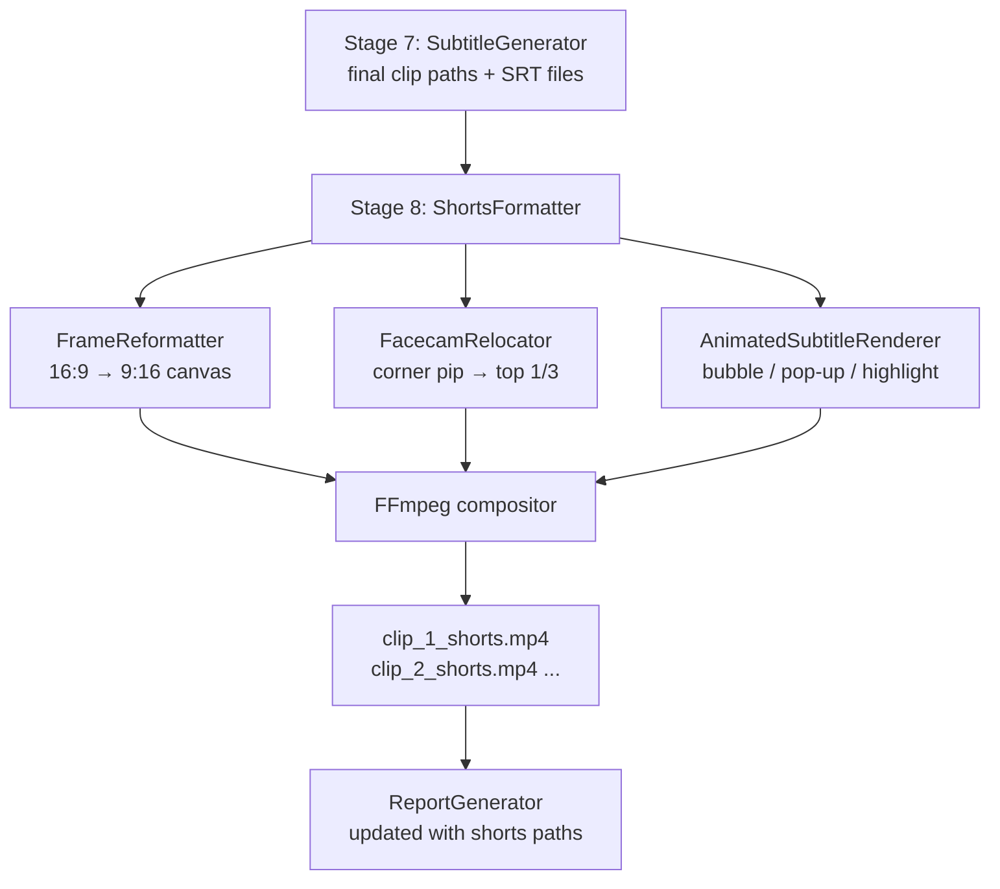
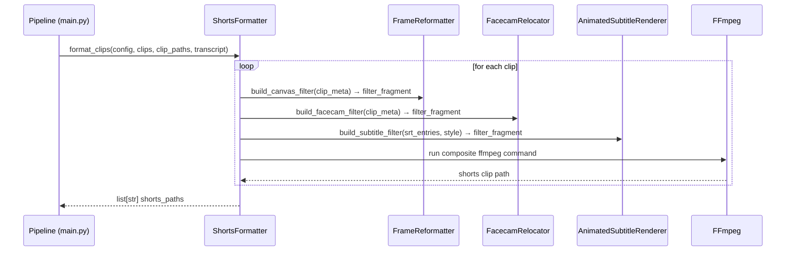
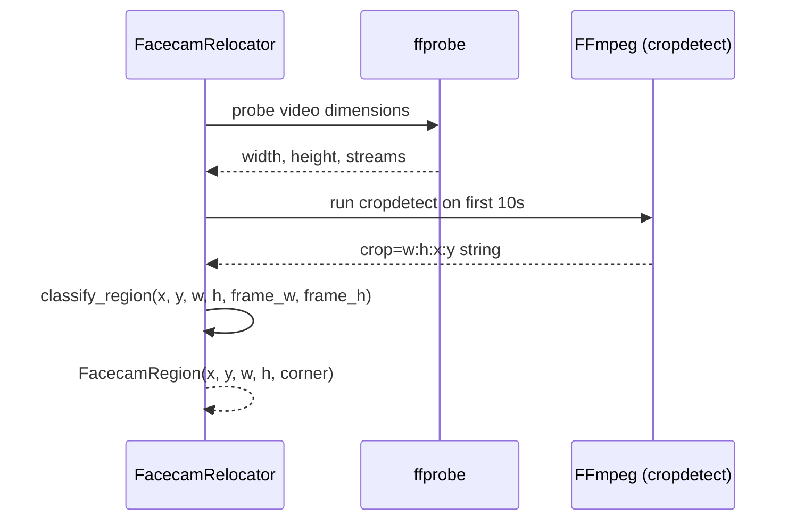

# Design Document: Vertical Shorts Formatter

## Overview

The Vertical Shorts Formatter is a post-export processing stage that transforms the pipeline's horizontal highlight clips into platform-ready vertical short-form videos (9:16 aspect ratio) suitable for YouTube Shorts, TikTok, and Instagram Reels. It handles three concerns: reformatting the frame from 16:9 to 9:16, intelligently repositioning the facecam overlay from a corner pip to the top third of the vertical canvas, and replacing the existing basic subtitle burn with an animated, visually engaging subtitle system featuring bubble letters, pop-up word reveals, and highlight effects.

The formatter runs as a new Stage 8 in the pipeline, consuming the final clip paths produced by Stage 7 (SubtitleGenerator) and producing a parallel set of `_shorts.mp4` files alongside the originals. It is opt-in via a `--shorts` CLI flag and a `shorts_enabled` config field so existing workflows are unaffected.

---

## Architecture



The three sub-components are orchestrated by a single `ShortsFormatter` class. Each sub-component produces an FFmpeg filter-graph fragment; the orchestrator assembles them into one composite `ffmpeg` invocation per clip to avoid repeated decode/encode cycles.

---

## Sequence Diagrams

### Main Formatting Flow



### Facecam Detection Flow



---

## Components and Interfaces

### ShortsFormatter

**Purpose**: Orchestrates the full clip-to-shorts conversion pipeline for a batch of clips.

**Interface**:
```python
class ShortsFormatter:
    def format_clips(
        self,
        config: Config,
        clips: list[Clip],
        clip_paths: list[str],
        transcript: Transcript,
    ) -> list[str]:
        """Convert each clip to vertical 9:16 format.
        Returns list of paths to *_shorts.mp4 files, in rank order.
        """

    def format_single_clip(
        self,
        config: Config,
        clip: Clip,
        clip_path: str,
        srt_entries: list[SRTEntry],
    ) -> str:
        """Convert one clip. Returns path to the shorts output file."""
```

**Responsibilities**:
- Coordinate FrameReformatter, FacecamRelocator, AnimatedSubtitleRenderer
- Assemble a single composite FFmpeg filter graph per clip
- Run FFmpeg once per clip (no intermediate files)
- Return shorts paths in rank order

---

### FrameReformatter

**Purpose**: Builds the FFmpeg filter fragment that creates a 9:16 canvas from a 16:9 source.

**Interface**:
```python
class FrameReformatter:
    def build_canvas_filter(
        self,
        src_width: int,
        src_height: int,
        target_width: int,   # default 1080
        target_height: int,  # default 1920
        layout: CanvasLayout,
    ) -> FilterFragment:
        """
        Returns an FFmpeg filtergraph fragment that:
        - Scales the gameplay area to fill the bottom 2/3 of the canvas
        - Pads the full canvas to target_width x target_height with black
        """
```

**Responsibilities**:
- Compute scale and pad parameters for the gameplay region (bottom ~2/3)
- Leave the top ~1/3 region empty for the facecam overlay
- Output a named pad node for downstream overlay operations

---

### FacecamRelocator

**Purpose**: Detects the facecam region in the source clip and builds the FFmpeg filter fragment to crop it out and overlay it in the top third of the vertical canvas.

**Interface**:
```python
class FacecamRelocator:
    def detect_facecam(
        self,
        clip_path: str,
        frame_width: int,
        frame_height: int,
    ) -> FacecamRegion | None:
        """
        Probe the clip to find the facecam pip region.
        Returns None if no facecam is detected.
        """

    def build_facecam_filter(
        self,
        region: FacecamRegion,
        canvas_width: int,
        canvas_height: int,
        top_third_height: int,
    ) -> FilterFragment:
        """
        Returns an FFmpeg filtergraph fragment that:
        - Crops the facecam from its source position
        - Scales it to fill the top 1/3 of the canvas (width-fitted, centered)
        - Overlays it at position (0, 0) on the canvas
        """
```

**Responsibilities**:
- Use ffprobe + cropdetect to locate the facecam pip
- Classify which corner the pip occupies
- Build crop + scale + overlay filter chain
- Handle the no-facecam case gracefully (skip overlay, fill top third with blurred gameplay)

---

### AnimatedSubtitleRenderer

**Purpose**: Builds the FFmpeg filter fragment (or generates an ASS subtitle file) that renders animated, visually engaging subtitles.

**Interface**:
```python
class AnimatedSubtitleRenderer:
    def build_subtitle_filter(
        self,
        srt_entries: list[SRTEntry],
        style: SubtitleStyle,
        canvas_width: int,
        canvas_height: int,
        gameplay_region_top: int,
    ) -> FilterFragment:
        """
        Returns an FFmpeg filtergraph fragment that burns animated subtitles
        into the gameplay region of the vertical canvas.
        """

    def generate_ass_file(
        self,
        srt_entries: list[SRTEntry],
        style: SubtitleStyle,
        output_path: str,
        canvas_width: int,
        canvas_height: int,
        gameplay_region_top: int,
    ) -> str:
        """
        Write an ASS subtitle file with animation tags.
        Returns the path to the written .ass file.
        """
```

**Responsibilities**:
- Convert SRTEntry list to ASS format with animation override tags
- Support multiple visual styles (bubble, pop-up, highlight, karaoke)
- Position subtitles in the lower portion of the gameplay region
- Apply word-level timing for karaoke/highlight effects

---

## Data Models

### ShortsConfig (extends Config)

```python
@dataclass
class ShortsConfig:
    # Master switch
    shorts_enabled: bool = False

    # Canvas dimensions
    shorts_width: int = 1080
    shorts_height: int = 1920

    # Layout split: top fraction reserved for facecam (0.0–1.0)
    facecam_top_fraction: float = 0.35

    # Facecam detection
    facecam_detection_enabled: bool = True
    # Seconds of clip to sample for facecam detection
    facecam_sample_duration: float = 10.0
    # Minimum fraction of frame area a pip must occupy to be considered a facecam
    facecam_min_area_fraction: float = 0.04
    # Maximum fraction of frame area (to exclude full-frame faces)
    facecam_max_area_fraction: float = 0.30

    # Subtitle style
    subtitle_style: str = "bubble"   # "bubble" | "popup" | "highlight" | "karaoke"
    subtitle_font_size: int = 72
    subtitle_font_name: str = "Impact"
    subtitle_primary_color: str = "&H00FFFFFF"   # ASS color: white
    subtitle_outline_color: str = "&H00000000"   # black outline
    subtitle_highlight_color: str = "&H0000FFFF" # yellow highlight
    subtitle_outline_width: float = 4.0
    subtitle_shadow_depth: float = 2.0
    subtitle_margin_bottom: int = 80  # px from bottom of gameplay region
    subtitle_words_per_group: int = 3
```

### FacecamRegion

```python
@dataclass
class FacecamRegion:
    x: int          # left edge in source frame pixels
    y: int          # top edge in source frame pixels
    width: int      # crop width
    height: int     # crop height
    corner: str     # "top-left" | "top-right" | "bottom-left" | "bottom-right"
    confidence: float  # 0.0–1.0, how confident the detection is
```

### CanvasLayout

```python
@dataclass
class CanvasLayout:
    canvas_width: int       # 1080
    canvas_height: int      # 1920
    facecam_x: int          # 0
    facecam_y: int          # 0
    facecam_width: int      # 1080
    facecam_height: int     # ~672 (35% of 1920)
    gameplay_x: int         # 0
    gameplay_y: int         # ~672
    gameplay_width: int     # 1080
    gameplay_height: int    # ~1248 (65% of 1920)
```

### FilterFragment

```python
@dataclass
class FilterFragment:
    filter_str: str         # FFmpeg -vf / -filter_complex fragment
    input_label: str        # e.g. "[v0]"
    output_label: str       # e.g. "[canvas]"
    extra_inputs: list[str] # additional -i paths needed (e.g. overlay sources)
```

### SubtitleStyle (enum)

```python
from enum import Enum

class SubtitleStyle(Enum):
    BUBBLE    = "bubble"    # rounded outline, bold, slight scale pop on entry
    POPUP     = "popup"     # words appear one at a time with a scale-in animation
    HIGHLIGHT = "highlight" # active word gets a colored background box
    KARAOKE   = "karaoke"   # word color changes as it is spoken
```

---

## Algorithmic Pseudocode

### Main Orchestration Algorithm

```pascal
ALGORITHM format_clips(config, clips, clip_paths, transcript)
INPUT:  config       — ShortsConfig with layout and style settings
        clips        — list of Clip objects (rank-ordered)
        clip_paths   — list of paths to exported .mp4 files
        transcript   — full Transcript for subtitle timing
OUTPUT: shorts_paths — list of paths to *_shorts.mp4 files

BEGIN
  ASSERT len(clips) = len(clip_paths)
  shorts_paths ← []

  FOR each (clip, clip_path) IN zip(clips, clip_paths) DO
    // Probe source dimensions
    (src_w, src_h) ← probe_video_dimensions(clip_path)
    ASSERT src_w > 0 AND src_h > 0

    // Compute canvas layout
    layout ← compute_canvas_layout(config, src_w, src_h)

    // Detect facecam
    IF config.facecam_detection_enabled THEN
      region ← detect_facecam(clip_path, src_w, src_h, config)
    ELSE
      region ← NULL
    END IF

    // Collect SRT entries for this clip
    srt_entries ← collect_srt_entries(clip, transcript, config)

    // Build filter graph
    canvas_frag  ← build_canvas_filter(src_w, src_h, layout)
    facecam_frag ← build_facecam_filter(region, layout)
    sub_frag     ← build_subtitle_filter(srt_entries, config.subtitle_style, layout)

    filter_graph ← assemble_filter_graph(canvas_frag, facecam_frag, sub_frag)

    // Run FFmpeg
    shorts_path ← derive_shorts_path(clip_path)
    run_ffmpeg_composite(clip_path, filter_graph, shorts_path, config)

    ASSERT file_exists(shorts_path)
    shorts_paths.append(shorts_path)
  END FOR

  RETURN shorts_paths
END
```

**Preconditions:**
- All clip_paths exist and are valid MP4 files
- config.shorts_width and config.shorts_height are positive integers
- 0.0 < config.facecam_top_fraction < 1.0

**Postconditions:**
- len(shorts_paths) = len(clip_paths)
- Each shorts path is a valid MP4 at 9:16 aspect ratio
- Original clip files are not modified

**Loop Invariants:**
- All previously processed clips have a corresponding valid shorts file
- shorts_paths length equals the number of completed iterations

---

### Facecam Detection Algorithm

```pascal
ALGORITHM detect_facecam(clip_path, frame_w, frame_h, config)
INPUT:  clip_path — path to the source clip
        frame_w   — source frame width in pixels
        frame_h   — source frame height in pixels
        config    — ShortsConfig
OUTPUT: region    — FacecamRegion or NULL

BEGIN
  // Run ffmpeg cropdetect on a short sample to find stable crop regions
  sample_duration ← config.facecam_sample_duration
  cropdetect_output ← run_ffmpeg_cropdetect(clip_path, sample_duration)

  // Parse all crop= lines from ffmpeg stderr
  crop_candidates ← parse_cropdetect_lines(cropdetect_output)

  IF crop_candidates IS EMPTY THEN
    RETURN NULL
  END IF

  // Find the most frequently reported crop region (mode)
  region_counts ← count_occurrences(crop_candidates)
  best_crop ← argmax(region_counts)

  // Validate: must be a pip-sized region, not the full frame
  area_fraction ← (best_crop.w * best_crop.h) / (frame_w * frame_h)

  IF area_fraction < config.facecam_min_area_fraction THEN
    RETURN NULL  // Too small — likely noise
  END IF

  IF area_fraction > config.facecam_max_area_fraction THEN
    RETURN NULL  // Too large — likely the gameplay area, not a pip
  END IF

  // Classify which corner the pip is in
  center_x ← best_crop.x + best_crop.w / 2
  center_y ← best_crop.y + best_crop.h / 2
  half_w   ← frame_w / 2
  half_h   ← frame_h / 2

  IF center_x < half_w AND center_y < half_h THEN
    corner ← "top-left"
  ELSE IF center_x >= half_w AND center_y < half_h THEN
    corner ← "top-right"
  ELSE IF center_x < half_w AND center_y >= half_h THEN
    corner ← "bottom-left"
  ELSE
    corner ← "bottom-right"
  END IF

  confidence ← region_counts[best_crop] / len(crop_candidates)

  RETURN FacecamRegion(
    x=best_crop.x, y=best_crop.y,
    width=best_crop.w, height=best_crop.h,
    corner=corner, confidence=confidence
  )
END
```

**Preconditions:**
- clip_path is a valid video file accessible by ffmpeg
- frame_w > 0, frame_h > 0
- 0.0 < config.facecam_min_area_fraction < config.facecam_max_area_fraction < 1.0

**Postconditions:**
- Returns NULL or a FacecamRegion with valid pixel coordinates within [0, frame_w] x [0, frame_h]
- confidence is in [0.0, 1.0]

**Loop Invariants:** N/A (no loops in this algorithm)

---

### Canvas Filter Assembly Algorithm

```pascal
ALGORITHM build_canvas_filter(src_w, src_h, layout)
INPUT:  src_w, src_h — source video dimensions
        layout       — CanvasLayout
OUTPUT: FilterFragment for the base canvas

BEGIN
  // Scale gameplay to fit the bottom portion of the canvas
  // Maintain aspect ratio, fit within gameplay_width x gameplay_height
  scale_w ← layout.gameplay_width
  scale_h ← ROUND(src_h * (layout.gameplay_width / src_w))

  IF scale_h > layout.gameplay_height THEN
    scale_h ← layout.gameplay_height
    scale_w ← ROUND(src_w * (layout.gameplay_height / src_h))
  END IF

  // Center horizontally within gameplay region
  pad_x ← (layout.gameplay_width - scale_w) / 2
  pad_y ← layout.gameplay_y + (layout.gameplay_height - scale_h) / 2

  filter_str ← FORMAT(
    "[0:v]scale={scale_w}:{scale_h}," +
    "pad={canvas_w}:{canvas_h}:{pad_x}:{pad_y}:black[canvas]",
    scale_w, scale_h,
    layout.canvas_width, layout.canvas_height,
    pad_x, pad_y
  )

  RETURN FilterFragment(
    filter_str=filter_str,
    input_label="[0:v]",
    output_label="[canvas]"
  )
END
```

**Preconditions:**
- src_w > 0, src_h > 0
- layout.gameplay_width > 0, layout.gameplay_height > 0

**Postconditions:**
- Output canvas is exactly layout.canvas_width x layout.canvas_height
- Gameplay video is aspect-ratio-correct and centered in the gameplay region
- Top facecam region is filled with black (to be overlaid by FacecamRelocator)

---

### Animated Subtitle ASS Generation Algorithm

```pascal
ALGORITHM generate_ass_file(srt_entries, style, output_path, layout)
INPUT:  srt_entries  — list of SRTEntry with word-level timing
        style        — SubtitleStyle enum value
        output_path  — path to write the .ass file
        layout       — CanvasLayout (for positioning)
OUTPUT: path to written .ass file

BEGIN
  ass_header ← build_ass_header(layout.canvas_width, layout.canvas_height, style)
  ass_events ← []

  FOR each entry IN srt_entries DO
    start_cs ← FLOOR(entry.start * 100)   // centiseconds
    end_cs   ← FLOOR(entry.end * 100)

    IF style = BUBBLE THEN
      // Bold text with thick outline, slight scale pop on entry
      text ← FORMAT(
        "{\an2\pos(%d,%d)\fscx110\fscy110\t(0,80,\fscx100\fscy100)}%s",
        layout.canvas_width / 2,
        layout.canvas_height - layout.subtitle_margin_bottom,
        entry.text.upper()
      )

    ELSE IF style = POPUP THEN
      // Each word group fades+scales in from 0
      text ← FORMAT(
        "{\an2\pos(%d,%d)\fad(80,0)\t(0,100,\fscx100\fscy100)\fscx0\fscy0}%s",
        layout.canvas_width / 2,
        layout.canvas_height - layout.subtitle_margin_bottom,
        entry.text.upper()
      )

    ELSE IF style = HIGHLIGHT THEN
      // Active word group gets a colored background box
      text ← FORMAT(
        "{\an2\pos(%d,%d)\3c&H0000FFFF&\bord6}%s",
        layout.canvas_width / 2,
        layout.canvas_height - layout.subtitle_margin_bottom,
        entry.text.upper()
      )

    ELSE IF style = KARAOKE THEN
      // Word-by-word color change using \k tags
      text ← build_karaoke_line(entry, layout)
    END IF

    ass_events.append(
      FORMAT("Dialogue: 0,%s,%s,Default,,0,0,0,,%s",
        centiseconds_to_ass_time(start_cs),
        centiseconds_to_ass_time(end_cs),
        text
      )
    )
  END FOR

  write_file(output_path, ass_header + NEWLINE.join(ass_events))
  RETURN output_path
END
```

**Preconditions:**
- srt_entries is non-empty
- style is a valid SubtitleStyle value
- layout.canvas_width > 0, layout.canvas_height > 0

**Postconditions:**
- Output file is a valid ASS subtitle file
- All entries have start < end times
- Subtitle positions are within canvas bounds

**Loop Invariants:**
- All previously processed entries have valid ASS Dialogue lines appended

---

## Key Functions with Formal Specifications

### probe_video_dimensions(clip_path) → (width, height)

**Preconditions:**
- clip_path is a non-empty string pointing to an existing file
- ffprobe is available on PATH

**Postconditions:**
- Returns (width, height) as positive integers
- Raises ValueError if the file cannot be probed

### compute_canvas_layout(config, src_w, src_h) → CanvasLayout

**Preconditions:**
- config.shorts_width > 0, config.shorts_height > 0
- 0.0 < config.facecam_top_fraction < 1.0
- src_w > 0, src_h > 0

**Postconditions:**
- layout.facecam_height + layout.gameplay_height = config.shorts_height
- layout.facecam_width = layout.gameplay_width = config.shorts_width
- layout.gameplay_y = layout.facecam_height

### run_ffmpeg_composite(clip_path, filter_graph, output_path, config) → None

**Preconditions:**
- clip_path exists and is a valid MP4
- filter_graph is a valid FFmpeg filter_complex string
- output_path parent directory exists

**Postconditions:**
- output_path exists and is a valid MP4
- output_path video stream is config.shorts_width x config.shorts_height
- Original clip_path is not modified
- Raises ShortsFormattingError on non-zero FFmpeg exit code

### collect_srt_entries(clip, transcript, config) → list[SRTEntry]

**Preconditions:**
- clip.start < clip.end
- transcript.segments is a list (may be empty)

**Postconditions:**
- All returned entries have start/end times relative to clip.start
- All returned entries have 0.0 <= start < end
- Returns empty list if no transcript segments overlap the clip window

---

## Error Handling

### No Facecam Detected

**Condition**: `detect_facecam` returns `None` (pip too small, too large, or not found)

**Response**: Fall back to a blurred/zoomed version of the gameplay video filling the top third. Use FFmpeg's `crop` + `scale` + `boxblur` to create an aesthetically pleasing background fill.

**Recovery**: Log a warning at INFO level. The clip is still produced — it just won't have a repositioned facecam.

### FFmpeg Composite Failure

**Condition**: The composite FFmpeg command exits non-zero.

**Response**: Raise `ShortsFormattingError` with the FFmpeg stderr. The pipeline catches this and logs it, then skips the shorts output for that clip (the original clip is unaffected).

**Recovery**: The original exported clip is always preserved. Shorts conversion failure is non-fatal to the main pipeline.

### ASS Subtitle Rendering Unavailable

**Condition**: FFmpeg is not compiled with libass.

**Response**: Fall back to the existing SRT-based `subtitles` filter with an enhanced style string (larger font, bold, outline). Log a warning that animated styles are unavailable.

**Recovery**: Clip is still produced with basic styled subtitles.

### Invalid SRT Timing

**Condition**: An SRTEntry has `start >= end` or negative timestamps.

**Response**: Skip the malformed entry and log a warning. Continue processing remaining entries.

**Recovery**: Subtitle file is still written with valid entries only.

---

## Testing Strategy

### Unit Testing Approach

- `test_frame_reformatter.py`: Test `build_canvas_filter` with various source aspect ratios (16:9, 4:3, 1:1, 9:16). Assert output canvas is always `shorts_width x shorts_height`. Assert gameplay region is correctly positioned.
- `test_facecam_relocator.py`: Test `classify_region` corner detection with known coordinates. Test `detect_facecam` with mocked ffmpeg output. Test area fraction validation boundaries.
- `test_animated_subtitle_renderer.py`: Test `generate_ass_file` for each SubtitleStyle. Assert valid ASS header is produced. Assert all SRTEntry timestamps appear in output. Test edge cases: empty entries, single word, very long text.
- `test_shorts_formatter.py`: Test `compute_canvas_layout` invariants. Test `collect_srt_entries` overlap logic. Test `derive_shorts_path` naming convention.

### Property-Based Testing Approach

**Property Test Library**: hypothesis

Key properties to test:
- For any valid `(src_w, src_h)` pair, `build_canvas_filter` always produces a canvas of exactly `(shorts_width, shorts_height)`.
- For any `FacecamRegion` with valid coordinates, `build_facecam_filter` produces overlay coordinates within `[0, canvas_width] x [0, canvas_height]`.
- For any list of `SRTEntry` objects, `generate_ass_file` produces a file where every entry's start time < end time.
- `compute_canvas_layout` always satisfies: `facecam_height + gameplay_height == canvas_height`.

### Integration Testing Approach

- End-to-end test with a synthetic 5-second 16:9 test video (generated by FFmpeg's `testsrc`): assert the output is 1080x1920, has audio, and the file size is non-zero.
- Test the full `format_clips` path with a mocked transcript to verify subtitle entries appear in the output ASS file.

---

## Performance Considerations

- **Single FFmpeg pass**: All three transformations (canvas reformat, facecam overlay, subtitle burn) are composed into one `filter_complex` and executed in a single FFmpeg invocation per clip. This avoids three separate encode/decode cycles.
- **Facecam detection sampling**: Only the first `facecam_sample_duration` seconds (default 10s) are sampled for cropdetect, keeping detection fast regardless of clip length.
- **Parallel processing**: `format_clips` uses `concurrent.futures.ThreadPoolExecutor` (same pattern as `extract_clips`) to process multiple clips concurrently.
- **Codec settings**: Uses `libx264 -preset fast -crf 23` for the shorts output — slightly slower than `ultrafast` but produces meaningfully smaller files suitable for upload.

---

## Security Considerations

- All file paths passed to FFmpeg subprocess calls are passed as list arguments (not shell strings), preventing shell injection.
- The `output_path` for shorts files is derived from the existing clip path using `os.path.splitext`, ensuring it stays within the configured `output_dir`.
- ASS subtitle content is derived from the transcript (already sanitized by Whisper). Special characters in subtitle text are escaped before insertion into ASS override tags.

---

## Dependencies

All dependencies are already present in the project:

| Dependency | Already in requirements.txt | Usage |
|---|---|---|
| `ffmpeg` (system) | Yes (used throughout pipeline) | Canvas reformat, facecam overlay, subtitle burn |
| `ffprobe` (system) | Yes (used in clip_extractor) | Video dimension probing, cropdetect |
| `subprocess` (stdlib) | Yes | FFmpeg/ffprobe invocation |
| `Pillow` | Yes (`Pillow==12.2.0`) | Optional: thumbnail preview of shorts layout |
| `hypothesis` | Yes (`hypothesis==6.112.2`) | Property-based tests |

No new Python packages are required. The feature relies entirely on FFmpeg's built-in filter capabilities (`scale`, `pad`, `crop`, `overlay`, `subtitles`/`ass`) which are standard in any modern FFmpeg build.

The ASS subtitle format is used instead of SRT for animated subtitles because ASS supports per-event animation override tags (`\t`, `\fad`, `\k`, `\fscx`, `\fscy`) that SRT does not.

---

## Correctness Properties

*A property is a characteristic or behavior that should hold true across all valid executions of a system — essentially, a formal statement about what the system should do. Properties serve as the bridge between human-readable specifications and machine-verifiable correctness guarantees.*

### Property 1: Canvas dimensions are always exact

*For any* positive source dimensions `(src_w, src_h)` and any valid `ShortsConfig`, `build_canvas_filter` produces a `FilterFragment` whose `filter_str` specifies a canvas of exactly `shorts_width × shorts_height` pixels — regardless of the source aspect ratio (16:9, 4:3, 1:1, 9:16, or arbitrary).

**Validates: Requirements 2.2, 2.6**

---

### Property 2: Gameplay region is correctly positioned in the canvas

*For any* positive source dimensions and any `facecam_top_fraction` in `(0.0, 1.0)`, the gameplay video's top-left corner in the padded canvas is at `y = round(canvas_height * facecam_top_fraction)` and `x = (canvas_width - scaled_width) / 2`, ensuring the top region is left empty and the gameplay is horizontally centred.

**Validates: Requirements 2.3, 2.4, 2.5**

---

### Property 3: CanvasLayout invariants always hold

*For any* `ShortsConfig` with positive `shorts_width`, `shorts_height`, and `facecam_top_fraction` in `(0.0, 1.0)`, `compute_canvas_layout` produces a `CanvasLayout` satisfying all of: `facecam_height + gameplay_height == canvas_height`, `facecam_width == gameplay_width == canvas_width`, `gameplay_y == facecam_height`, `facecam_x == 0`, and `facecam_y == 0`.

**Validates: Requirements 8.2, 8.3, 8.4, 8.5**

---

### Property 4: Facecam area fraction filtering is correct

*For any* crop region `(x, y, w, h)` within a frame of dimensions `(frame_w, frame_h)`, `classify_region` returns `None` when `(w * h) / (frame_w * frame_h) < facecam_min_area_fraction` or `> facecam_max_area_fraction`, and returns a valid `FacecamRegion` otherwise.

**Validates: Requirements 3.3, 3.4**

---

### Property 5: Corner classification is consistent with centre coordinates

*For any* `FacecamRegion` with valid pixel coordinates within `[0, frame_w] × [0, frame_h]`, the `corner` field is one of `{"top-left", "top-right", "bottom-left", "bottom-right"}` and is consistent with whether the region's centre `(x + w/2, y + h/2)` falls in the left/right and top/bottom halves of the frame.

**Validates: Requirements 3.5**

---

### Property 6: Confidence score is always in [0.0, 1.0]

*For any* non-empty list of cropdetect candidate strings, the `confidence` field of the returned `FacecamRegion` is in the range `[0.0, 1.0]` and equals `count(best_crop) / len(candidates)`.

**Validates: Requirements 3.6**

---

### Property 7: Facecam filter overlay coordinates are within canvas bounds

*For any* `FacecamRegion` with valid coordinates and any `CanvasLayout`, `build_facecam_filter` produces overlay coordinates `(overlay_x, overlay_y)` satisfying `0 ≤ overlay_x ≤ canvas_width` and `0 ≤ overlay_y ≤ canvas_height`.

**Validates: Requirements 4.2, 4.3**

---

### Property 8: Collected SRT entries are time-adjusted and non-negative

*For any* `Clip` with `start < end` and any `Transcript`, `collect_srt_entries` returns only entries where `0.0 ≤ entry.start < entry.end`, with all timestamps adjusted to be relative to `clip.start`.

**Validates: Requirements 9.2, 9.3**

---

### Property 9: Collected SRT entries only overlap the clip window

*For any* `Clip` and `Transcript`, every `SRTEntry` returned by `collect_srt_entries` corresponds to a transcript segment that overlaps the clip's `[start, end]` window — no entries from outside the window are included.

**Validates: Requirements 9.1**

---

### Property 10: ASS file always has a valid structure

*For any* list of `SRTEntry` objects (including empty), `generate_ass_file` produces a file containing the `[Script Info]`, `[V4+ Styles]`, and `[Events]` section headers, with every `Dialogue` line having `start_time < end_time`.

**Validates: Requirements 13.1, 13.2, 5.1**

---

### Property 11: Invalid SRT entries are excluded from ASS output

*For any* list of `SRTEntry` objects that contains entries with `start >= end` or negative timestamps mixed with valid entries, `generate_ass_file` produces an ASS file whose `Dialogue` lines correspond only to the valid entries — the invalid entries are silently skipped.

**Validates: Requirements 5.10, 11.4**

---

### Property 12: Subtitle text is always uppercased in ASS output

*For any* `SRTEntry` with arbitrary text and any `SubtitleStyle`, the corresponding `Dialogue` line in the generated ASS file contains the uppercase version of the entry's text.

**Validates: Requirements 5.8**

---

### Property 13: Subtitle positions are within canvas bounds

*For any* `CanvasLayout` with positive `canvas_width` and `canvas_height`, and any `subtitle_margin_bottom` in `[0, canvas_height)`, the subtitle `\pos(x, y)` coordinates in the generated ASS file satisfy `0 ≤ x ≤ canvas_width` and `0 ≤ y ≤ canvas_height`.

**Validates: Requirements 5.7, 13.4**

---

### Property 14: Shorts output path is derived from clip path stem

*For any* clip path string, `derive_shorts_path` returns a path whose stem equals the original stem with `_shorts` appended, in the same directory, with the `.mp4` extension.

**Validates: Requirements 7.1, 7.2**
