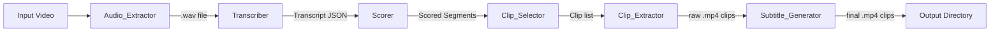

# Design Document: Video Highlight Generator

## Overview

The Video Highlight Generator is a local, self-hosted Python pipeline that processes a video file through a sequence of discrete stages to produce short, subtitle-burned highlight clips. The pipeline runs entirely offline, relying on Whisper for speech-to-text transcription and FFmpeg for all media I/O. No external API calls are made at any stage.

The pipeline accepts a single video file as input and produces multiple `.mp4` clips (20–45 seconds each) with burned-in subtitles. Each stage is implemented as an independent Python module, making the system easy to test, extend, and replace piece by piece.

### Key Design Goals

- **Offline-first**: All processing uses locally installed tools (Whisper, FFmpeg, optional local LLM).
- **Modular**: Each stage is a separate module with a well-defined function interface.
- **Deterministic scoring**: Given the same input, the pipeline produces the same output (LLM scoring aside).
- **Fail-fast with clear errors**: Every stage raises descriptive exceptions on failure rather than silently degrading.

---

## Architecture

The pipeline follows a linear, staged architecture. Each stage consumes the output of the previous stage and produces a well-typed artifact for the next.



### Execution Model

The pipeline is invoked via `python main.py <input_video_path>`. The `main.py` orchestrator:

1. Parses CLI arguments and loads configuration.
2. Creates a temporary working directory.
3. Calls each stage module in sequence, passing the shared `Config` object and the output of the previous stage.
4. Logs stage start/end and elapsed time to stdout.
5. On success, prints the paths of all exported clips and deletes the temp directory.
6. On any stage failure, logs the error to stderr and exits with a non-zero code.

### Directory Layout

```
video-highlight-generator/
├── main.py                  # CLI entry point and orchestrator
├── config.py                # Config dataclass and defaults
├── pipeline/
│   ├── __init__.py
│   ├── audio_extractor.py
│   ├── transcriber.py
│   ├── scorer.py
│   ├── clip_selector.py
│   ├── clip_extractor.py
│   └── subtitle_generator.py
└── tests/
    ├── test_audio_extractor.py
    ├── test_transcriber.py
    ├── test_scorer.py
    ├── test_clip_selector.py
    ├── test_clip_extractor.py
    └── test_subtitle_generator.py
```

---

## Components and Interfaces

Each module exposes a single primary function. All functions accept a `Config` object as their first argument.

### Audio Extractor

```python
def extract_audio(config: Config, video_path: str) -> str:
    """
    Extract audio from video_path to a mono 16kHz WAV file.
    Returns the path to the extracted .wav file.
    Raises FileNotFoundError if video_path does not exist.
    Raises AudioExtractionError if no audio track is found or FFmpeg fails.
    """
```

Internally calls FFmpeg with:
```
ffmpeg -i <video_path> -ac 1 -ar 16000 -vn <output.wav>
```

### Transcriber

```python
def transcribe(config: Config, wav_path: str) -> Transcript:
    """
    Transcribe wav_path using the local Whisper model.
    Returns a Transcript (may have empty segment list if no speech detected).
    Serializes the Transcript to a JSON file in config.work_dir.
    Raises FileNotFoundError if wav_path does not exist.
    """
```

Uses `whisper.load_model(config.whisper_model).transcribe(wav_path)` with `word_timestamps=True`.

### Scorer

```python
def score_segments(config: Config, transcript: Transcript, wav_path: str) -> list[ScoredSegment]:
    """
    Compute Clip_Score for each segment in transcript.
    Returns a list of ScoredSegment objects with text_score, audio_score,
    llm_score (if enabled), and clip_score fields.
    """
```

Sub-functions (also importable for unit testing):

```python
def compute_text_score(config: Config, segment: Segment) -> float: ...
def compute_audio_score(segments: list[Segment], wav_path: str) -> list[float]: ...
def compute_llm_score(config: Config, segment: Segment) -> float: ...  # optional
def combine_scores(config: Config, text: float, audio: float, llm: float | None) -> float: ...
```

### Clip Selector

```python
def select_clips(config: Config, scored_segments: list[ScoredSegment], transcript: Transcript, video_duration: float) -> list[Clip]:
    """
    Rank segments by clip_score, select top N, expand to 20-45s,
    merge overlapping clips, and return the final Clip list.
    """
```

### Clip Extractor

```python
def extract_clips(config: Config, clips: list[Clip], video_path: str) -> list[str]:
    """
    Extract each Clip from video_path using FFmpeg.
    Returns a list of paths to the extracted .mp4 files.
    Raises ClipExtractionError if FFmpeg fails.
    """
```

### Subtitle Generator

```python
def generate_subtitles(config: Config, clips: list[Clip], transcript: Transcript, clip_paths: list[str]) -> list[str]:
    """
    For each clip, produce an SRT file and burn subtitles into the clip video.
    Returns a list of paths to the final subtitle-burned .mp4 files.
    Raises SubtitleError if FFmpeg fails.
    """
```

---

## Data Models

All data models are implemented as Python `dataclass` objects for clarity and easy serialization.

### Config

```python
@dataclass
class Config:
    # Paths
    work_dir: str                    # Temporary working directory
    output_dir: str = "output"       # Where final clips are saved

    # Whisper
    whisper_model: str = "base"      # Whisper model size: tiny/base/small/medium/large

    # Scoring weights
    text_weight: float = 0.4
    audio_weight: float = 0.6
    llm_weight: float = 0.0          # 0.0 = LLM disabled

    # LLM (optional)
    llm_enabled: bool = False
    llm_endpoint: str = "http://localhost:11434/api/generate"
    llm_model: str = "llama3"

    # Keywords for text scoring
    keywords: list[str] = field(default_factory=lambda: [
        "crazy", "important", "watch this", "incredible", "unbelievable"
    ])

    # Clip selection
    top_n_clips: int = 5
    min_clip_duration: float = 20.0
    max_clip_duration: float = 45.0
```

### Segment

```python
@dataclass
class Segment:
    start: float    # seconds
    end: float      # seconds
    text: str
```

### Transcript

```python
@dataclass
class Transcript:
    segments: list[Segment]

    def to_dict(self) -> dict: ...
    @classmethod
    def from_dict(cls, data: dict) -> "Transcript": ...
```

### ScoredSegment

```python
@dataclass
class ScoredSegment:
    segment: Segment
    text_score: float       # [0.0, 1.0]
    audio_score: float      # [0.0, 1.0]
    llm_score: float        # [0.0, 1.0], 0.0 if LLM disabled
    clip_score: float       # weighted combination
```

### Clip

```python
@dataclass
class Clip:
    start: float            # seconds, >= 0.0
    end: float              # seconds, <= video_duration
    score: float            # clip_score of the seed segment
    rank: int               # 1-based rank by score
    segment_indices: list[int]  # indices into transcript.segments
```

### SRT Entry

```python
@dataclass
class SRTEntry:
    index: int
    start: float    # seconds, relative to clip start
    end: float      # seconds, relative to clip start
    text: str
```

---

## Correctness Properties

*A property is a characteristic or behavior that should hold true across all valid executions of a system — essentially, a formal statement about what the system should do. Properties serve as the bridge between human-readable specifications and machine-verifiable correctness guarantees.*

### Property 1: Transcript serialization round-trip

*For any* valid Transcript (including empty segment lists and segments with arbitrary text, start, and end values), serializing it to JSON and deserializing it back SHALL produce a Transcript that is structurally and value-equivalent to the original.

**Validates: Requirements 2.7**

---

### Property 2: Text score determinism

*For any* Segment with a given text value, calling `compute_text_score` multiple times SHALL always return the same float value.

**Validates: Requirements 3.6**

---

### Property 3: Text score is normalized

*For any* Segment with arbitrary text content, the value returned by `compute_text_score` SHALL be in the range [0.0, 1.0].

**Validates: Requirements 3.5**

---

### Property 4: Text score monotonicity

*For any* Segment text T, adding a keyword, an exclamation mark, a question mark, or additional non-whitespace characters to T SHALL produce a text score that is greater than or equal to the score of T alone. That is, enriching a segment's text with any signal that the scorer rewards SHALL never decrease the score.

**Validates: Requirements 3.2, 3.3, 3.4**

---

### Property 5: Audio score is normalized

*For any* non-empty list of Segments and a corresponding WAV file, every Audio_Score returned by `compute_audio_score` SHALL be in the range [0.0, 1.0].

**Validates: Requirements 4.3, 4.5**

---

### Property 6: Clip score equals weighted sum

*For any* combination of text_score, audio_score, and llm_score values (all in [0.0, 1.0]) and any non-negative weight configuration, `combine_scores` SHALL return exactly `text_weight * text_score + audio_weight * audio_score + llm_weight * llm_score`.

**Validates: Requirements 6.1, 6.4**

---

### Property 7: Clip score monotonicity with text score

*For any* two inputs A and B where A has a strictly higher text_score than B and both have identical audio_score and llm_score values, `combine_scores` SHALL return a value for A that is greater than or equal to the value for B.

**Validates: Requirements 6.5**

---

### Property 8: Score weights sum to 1.0

*For any* Config where `llm_enabled` is True, the values of `text_weight + audio_weight + llm_weight` SHALL equal 1.0 (within floating-point tolerance of 1e-9).

**Validates: Requirements 6.3**

---

### Property 9: Clip boundary invariant

*For any* list of scored segments, transcript, and positive video duration, every Clip returned by `select_clips` SHALL satisfy all of the following simultaneously: (a) duration (end − start) is between 20.0 and 45.0 seconds inclusive, (b) start is greater than or equal to 0.0, and (c) end is less than or equal to the total video duration.

**Validates: Requirements 7.3, 7.5, 7.8**

---

### Property 10: Clip selection preserves score ordering

*For any* list of scored segments, the Clips returned by `select_clips` SHALL be ordered such that no Clip has a lower seed score than any Clip that appears after it in the list (descending score order).

**Validates: Requirements 7.1**

---

### Property 11: SRT timestamp offset

*For any* Clip with a given start time and any Segment within that Clip's time range, the SRT entry produced for that Segment SHALL have a start timestamp equal to `segment.start − clip.start` and an end timestamp equal to `segment.end − clip.start`.

**Validates: Requirements 9.2**

---

### Property 12: SRT entry count matches in-range segments

*For any* Clip and Transcript, the number of entries in the generated SRT file SHALL equal the number of non-empty Segments whose time range falls within the Clip's time range.

**Validates: Requirements 9.1, 9.5**

---

### Property 13: SRT serialization round-trip

*For any* valid list of SRT entries (with arbitrary indices, timestamps, and non-empty text), serializing them to SRT format and parsing the result back SHALL produce an equivalent list of entries.

**Validates: Requirements 9.6**

---

## Error Handling

Each module raises a specific, descriptive exception rather than a generic one. All custom exceptions inherit from a base `PipelineError`.

| Exception | Raised by | Condition |
|---|---|---|
| `FileNotFoundError` | Audio_Extractor, Transcriber | Input file path does not exist |
| `AudioExtractionError` | Audio_Extractor | No audio track found; FFmpeg not on PATH; FFmpeg non-zero exit |
| `TranscriptionError` | Transcriber | Whisper model load failure |
| `ClipExtractionError` | Clip_Extractor | FFmpeg non-zero exit during extraction |
| `SubtitleError` | Subtitle_Generator | FFmpeg non-zero exit during subtitle burn |
| `LLMScoringError` | Scorer | LLM endpoint unreachable (non-fatal: falls back to score 0.0) |

### Error Propagation

The orchestrator in `main.py` wraps the entire pipeline in a `try/except PipelineError` block. On any exception:
1. The error message is written to `stderr`.
2. The process exits with code `1`.
3. The temporary working directory is **not** deleted (to aid debugging).

On success, the temp directory is deleted.

---

## Testing Strategy

### Approach

The project uses **pytest** as the test runner and **Hypothesis** as the property-based testing library. Both are standard choices for Python projects.

### Unit Tests

Unit tests cover specific examples, edge cases, and error conditions for each module:

- `test_audio_extractor.py`: Mock FFmpeg subprocess calls; verify correct arguments, error raising on missing file, missing audio track, missing FFmpeg.
- `test_transcriber.py`: Mock `whisper.load_model`; verify JSON serialization, empty transcript handling.
- `test_scorer.py`: Concrete examples for keyword detection, punctuation scoring, audio score with known RMS values, LLM fallback on unparseable response.
- `test_clip_selector.py`: Overlap merging logic, boundary clamping (start < 0, end > duration), merge-exceeds-45s discard logic.
- `test_clip_extractor.py`: Mock FFmpeg; verify stream-copy fallback to re-encode, output filename pattern, directory creation.
- `test_subtitle_generator.py`: SRT timestamp adjustment, empty segment omission, FFmpeg error propagation.

### Property-Based Tests (Hypothesis)

Each property from the Correctness Properties section is implemented as a single Hypothesis test. Minimum 100 iterations per test (Hypothesis default is 100; `@settings(max_examples=100)` is applied explicitly).

Each test is tagged with a comment referencing the design property:

```python
# Feature: video-highlight-generator, Property 1: Transcript serialization round-trip
@given(transcript=st.builds(Transcript, segments=st.lists(...)))
@settings(max_examples=100)
def test_transcript_roundtrip(transcript):
    assert Transcript.from_dict(transcript.to_dict()) == transcript
```

**Property tests to implement:**

| Test | Property | Library Strategy |
|---|---|---|
| `test_transcript_roundtrip` | Property 1 | `st.builds(Transcript, ...)` with arbitrary segment lists |
| `test_text_score_determinism` | Property 2 | `st.builds(Segment, ...)` with arbitrary text |
| `test_text_score_normalized` | Property 3 | `st.builds(Segment, ...)` with arbitrary text |
| `test_text_score_monotonicity` | Property 4 | Generate base text; append keyword / `!` / extra chars; assert score non-decreasing |
| `test_audio_score_normalized` | Property 5 | Mocked WAV data with `st.lists(st.builds(Segment, ...))` |
| `test_clip_score_weighted_sum` | Property 6 | `st.floats(0.0, 1.0)` for sub-scores; `st.floats(min_value=0.0)` for weights |
| `test_clip_score_monotone_text` | Property 7 | Two floats where `text_a >= text_b`; equal audio/llm scores |
| `test_weights_sum_to_one` | Property 8 | `st.floats(0.0, 1.0)` for llm_weight; derive others proportionally |
| `test_clip_boundary_invariant` | Property 9 | `st.lists(st.builds(ScoredSegment, ...))` with valid video duration |
| `test_clip_score_ordering` | Property 10 | `st.lists(st.builds(ScoredSegment, ...))` |
| `test_srt_timestamp_offset` | Property 11 | `st.builds(Segment, ...)` with `st.floats(min_value=0.0)` for clip start |
| `test_srt_entry_count` | Property 12 | `st.builds(Clip, ...)` with `st.lists(st.builds(Segment, ...))` |
| `test_srt_roundtrip` | Property 13 | `st.lists(st.builds(SRTEntry, ...))` with non-empty text |

### Integration Tests

A lightweight integration test (`test_integration.py`) uses a short synthetic video (generated with FFmpeg in the test fixture) to run the full pipeline end-to-end and verify:
- Output directory contains the expected number of `.mp4` files.
- Each output file has a duration between 20 and 45 seconds (verified via `ffprobe`).
- No temporary files remain after successful completion.
